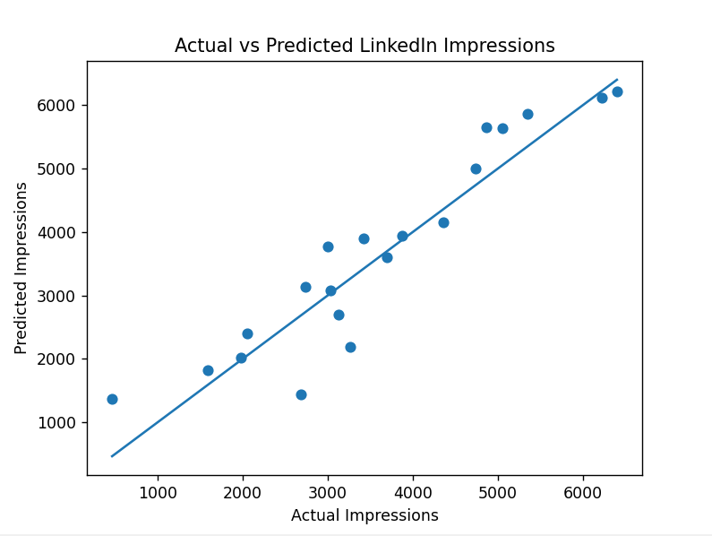

# 🚀 LinkedIn Post Impression Predictor

## 📌 Overview
Can Machine Learning predict if a LinkedIn post will go viral? I built a Linear Regression model in Python using Scikit-learn to predict **Day 1 (First 24 Hours)** impressions based on temporal and textual features. 

The project includes an interactive Command Line Interface (CLI) that automatically parses raw post text to extract features and generate real-time predictions.

## 📊 The Features ($x$)
1. **Word Count:** Extracted automatically from pasted text (measures dwell time).
2. **Hashtags:** Extracted automatically from pasted text (measures keyword optimization).
3. **Hour Posted (0-23):** Manual input (measures timing and audience activity).

## 📈 Model Performance (100+ Rows of Data)
* **Accuracy ($R^2$ Score):** 0.86
* **Mean Absolute Error (MAE):** 437.67 impressions
* **Root Mean Squared Error (RMSE):** 559.81 impressions

## 💡 Real-World ML Insight
I tested this model on a recent "25 DSA Patterns" post. The model predicted ~1,160 views for Day 1 linear traction, which was highly accurate! However, because the post included a high-value PDF, it triggered an exponential viral loop, reaching 21,000+ views over 7 days. 

**Takeaway:** Linear regression perfectly captures linear network growth, but mathematically cannot predict the exponential power-law curves of social media algorithms once a high-value asset triggers a massive share loop.

## 💻 Tech Stack
* **Language:** Python
* **Libraries:** Scikit-learn, Pandas, NumPy, Matplotlib
